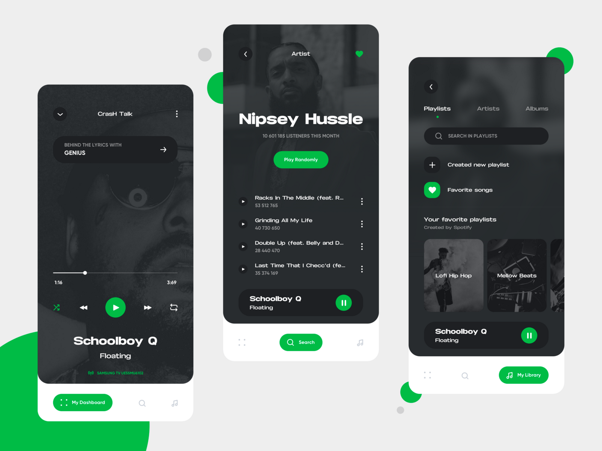

# Threadist

Threadist is a multi-platform app that crawls Reddit stories based on user interests and tell these interesting tales to the users with amazing narrating voices

## System design

User interface
- implemented using React Native
- HomeScreen:
    - this will be the main user interface, and it will be similar to the spotify UI
    - link to spotify UI: 
    - That is, we will have a exploration screen to view a list of reddit stories and search for them too
- Blink-read
    - We will have a little "music player" where the user can play or pause the stories, or skip the stories
- other screens: just leave the other screens as is
- user actions
    - search stories
    - explore different subreddits
    - explore list of stories in subreddits
    - listen to a recommended playlist of stories

Backend
- fastAPI backend
- will have two major routes: reddit api, and recommendation
- reddit api
    - an API that supports the UI actions (search stories, subreddits, list of stories)
    - provide a simple suite of HTTP methods that well-supports our app
    - needs to filter the reddit posts for ones that feel like stories (but don't make the implementation too complicated here)
- recommendation
    - is aware of the current subreddits and stories the user is browsing, the story the user selects to play, and user data from supabase
    - can crawl reddit for appropriate stories
    - provides a list of recommended stories for the user to play
- ElevenLabs TTS
    - provided a reddit story, returns a stream of audio

database design
- Here are the schemas we use for our current supabase database
```sql
create table public.category_subreddits (
  csid uuid not null default gen_random_uuid (),
  category_id uuid null,
  subreddit text not null,
  constraint category_subreddits_pkey primary key (csid),
  constraint category_subreddits_category_id_fkey foreign KEY (category_id) references interest_categories (category_id) on delete CASCADE
) TABLESPACE pg_default;

create table public.interest_categories (
  category_id uuid not null default gen_random_uuid (),
  slug text not null,
  label text not null,
  emoji text null,
  description text null,
  constraint interest_categories_pkey primary key (category_id),
  constraint interest_categories_slug_key unique (slug)
) TABLESPACE pg_default;

create table public.user_interests (
  interest_id uuid not null default gen_random_uuid (),
  csid uuid null,
  user_id uuid null,
  weight integer not null default 1,
  constraint user_interests_pkey primary key (interest_id),
  constraint user_interests_csid_fkey foreign KEY (csid) references category_subreddits (csid) on delete CASCADE,
  constraint user_interests_user_id_fkey foreign KEY (user_id) references auth.users (id) on delete CASCADE
) TABLESPACE pg_default;
```

## Project folder structure

This project will follow a monorepo approach to organize files. It will follow the following organization

- backend: fastAPI backend
- frontend: React Native app
- helpful-code: some helpful snippets of code that the AI can use to help implementation
    - ElevenLabs-example: an example node text to speech stream for elevenlabs
    - Our complete figma designs are within the figma-designs folder

## Other helpful links
- Reddit api: https://www.reddit.com/dev/api/
- ElevenLabs api: https://elevenlabs.io/docs/overview